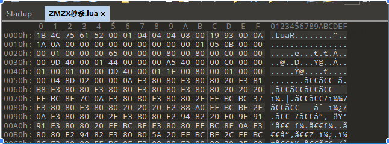
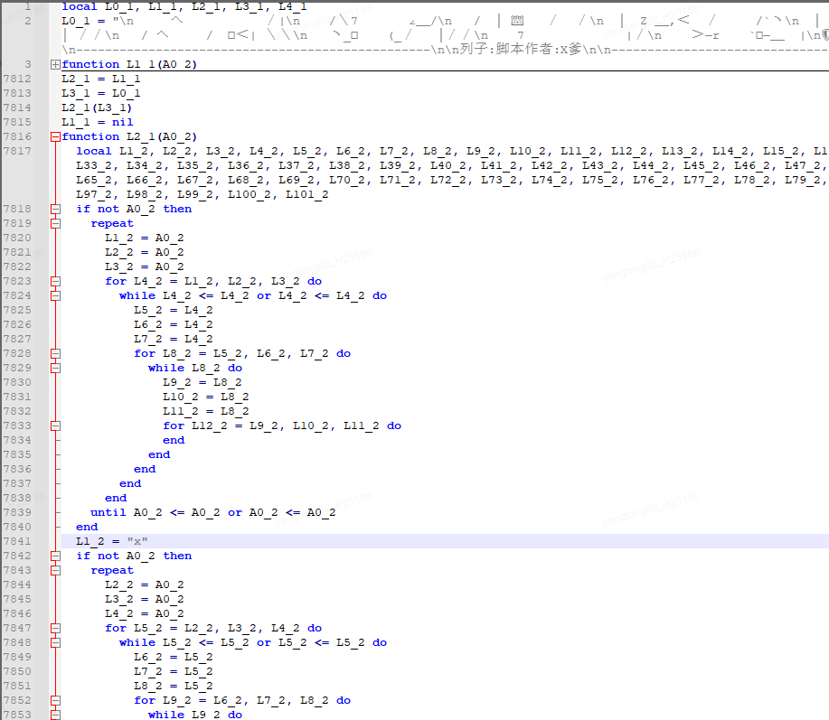
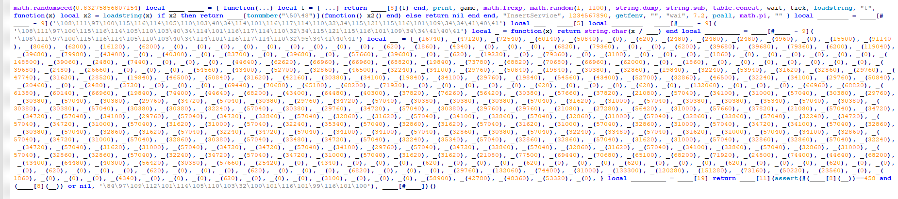
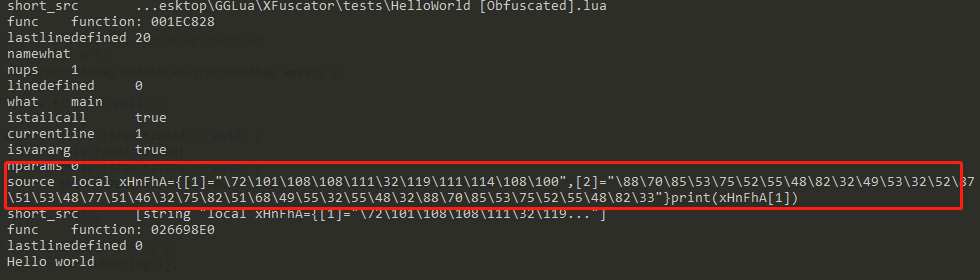
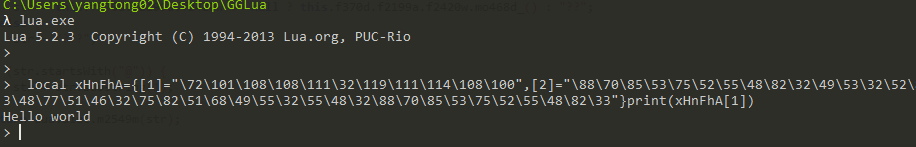
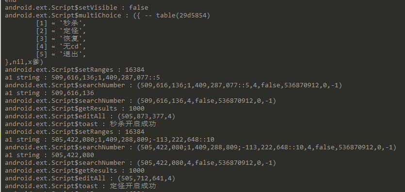

# GG lua脚本分析

起因：碰到一个GG脚本，需要知道这个脚本做了什么。



使用unluac反编译，lua脚本已被混淆，完全不可读：

<!-- more -->




分析过程中发现，GG使用的lua是添加了一些gg api 的luaJ。

根据测试混淆demo，可以发现使用lua的debug.getinfo可以获取到相对可读的lua代码

混淆前：

print("Hello world")

混淆后

 

执行代码：

```lua
function trace (event, line)
    local table_info = debug.getinfo(2)
    for k,v in pairs(table_info) do
        print(k,v)
    end
end
debug.sethook(trace, "l")
```



红框中的代码执行逻辑就比较清晰。



luac相关的混淆对抗分析难度比较大，由于时间关系，暂时搁置一下。

如何知道外挂脚本修改了什么数据，也可以通过hook GG 相关的api。

frida js

```js
Java.perform(()=>{
    Java.enumerateLoadedClasses({
        onMatch(name: string, handle: NativePointer): void {
            if(name.startsWith("android.ext.Script$")){
                if(name == "android.ext.Script$isVisible"||name == "android.ext.Script$ApiFunction"
                    ||name == "android.ext.Script$BusyApiFunction"||name =="android.ext.Script$DebugFunctio"
                ||name.endsWith("$clearResults"))
                    return
                const klass = Java.use(name);
                console.log(JSON.stringify(klass))
                if("android.ext.Script$ApiFunction"==klass.$super.$className||"android.ext.Script$BusyApiFunction"==klass.$super.$className){
                    for(let m of klass.$ownMembers){

                        if(m == "a" &&typeof klass[m] == "function"){
                            try{
                                Java.use(name).a.overload().implementation = function () {
                                    console.log(this.a())
                                    return this.a()
                                }
                            }catch (e){
                                console.log(e)
                                console.log(name)
                            }
                        }

                        if(m == "d" &&typeof klass[m] == "function"){
                            try{
                                Java.use(name).d.implementation = function (a) {
                                    console.log(name,":",a)
                                    return this.d(a);
                                }
                            }catch (e){
                                console.log(e)
                                console.log(name)
                            }
                        }

                        if(m == "b" &&typeof klass[m] == "function"){
                            try{
                                Java.use(name).b.implementation = function (a) {
                                    console.log(name,":",a)
                                    return this.b(a);
                                }
                            }catch (e){
                                console.log(e)
                                console.log(name)
                            }
                        }

                    }
                }


            }
        },

        onComplete(): void {
        }
    })    
})

console.log("end")
```



目前可以看到GG修改了什么地方，但是并不能知晓修改游戏的什么地方。

---

后续可以继续调研luaj和luac反混淆相关

