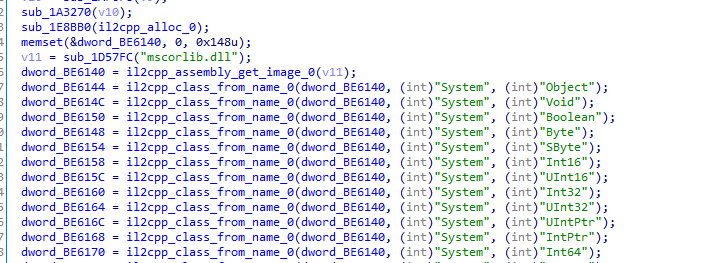

版本：3.2

该游戏的保护又升级了，围观一下安全性怎么样。

## 分析

一些il2cpp导出函数被隐藏掉了，现在只有两个


<!-- more -->


很明显，il2cpp_get_api_table 第一个就是il2cpp_init。


对比未被修改的unity（隐藏了，但是几乎没隐藏）



根据分析il2cpp_class_from_name，可以看出mhy对Il2CppImage、class等内存结构进行了修改。


之前分析的SetupMethodsLocked下hook拿到的实在是太乱了。毫无疑问，这里也被修改过。（此处的dlclose十分异常


此时在il2cpp里面分析确实过于麻烦了，换个思路，il2cpp相关的api是需要unity调用的。所以unity里面的一些信息可以反推il2cpp的table表。


接下来就是体力活去对比分析，附上一些关键的函数（在unity.so里面）：


附上frida代码：

```js
let so = Process.findModuleByName("libil2cpp.so")
let il2cpp_method_get_name = new NativeFunction(so.base.add(0x4260354),'pointer',['pointer'])
let il2cpp_method_get_param = new NativeFunction(so.base.add(0x425FEC4),'pointer',['pointer','int'])
let il2cpp_method_get_return_type = new NativeFunction(so.base.add(0x42306EC),'pointer',['pointer'])

let il2cpp_class_from_type = new NativeFunction(so.base.add(0x4251ED8),'pointer',['pointer'])
let il2cpp_class_get_name  = new NativeFunction(so.base.add(0x4252E48),'pointer',['pointer'])


Interceptor.attach(so.base.add(0x4252BE4),{
    onEnter:function (args) {
        // console.log("---------il2cpp_class_get_methods--------")
        this.class = args[0]

    },
    onLeave:function (ret) {
        try{
            let classname = this.class.add(40).readPointer().readCString()
            let namespace = this.class.add(120).readPointer().readCString()
            let name_ptr = il2cpp_method_get_name(ret)
            let ret_type = il2cpp_method_get_return_type(ret)
            let ret_type_class = il2cpp_class_from_type(ret_type)
            let ret_class_name = il2cpp_class_get_name(ret_type_class)

            //InvokerMethod ret.add(16)  methodPointer ret
             let parameters_count = ret.add(50).readU8()
            let pstr = "("
            for(let idx = 0;idx<parameters_count;idx++){
                let param = il2cpp_method_get_param(ret,idx)
                let type = il2cpp_class_from_type(param)
                let typeName = il2cpp_class_get_name(type)
                pstr += ptr(typeName).readCString() + "  a"+idx +" ,"
            }
            pstr+=");"
            console.log("[*]"+ret.readPointer()+"   --> "+ptr(ret_class_name).readCString()+"  "+namespace+"."+classname+"."+ptr(name_ptr).readCString()+pstr)

        }catch (e) {
            console.log(e.toString())
        }

    }
})
```

一些被处理过的符号信息：


一些sdk api：


一些unity的api：


