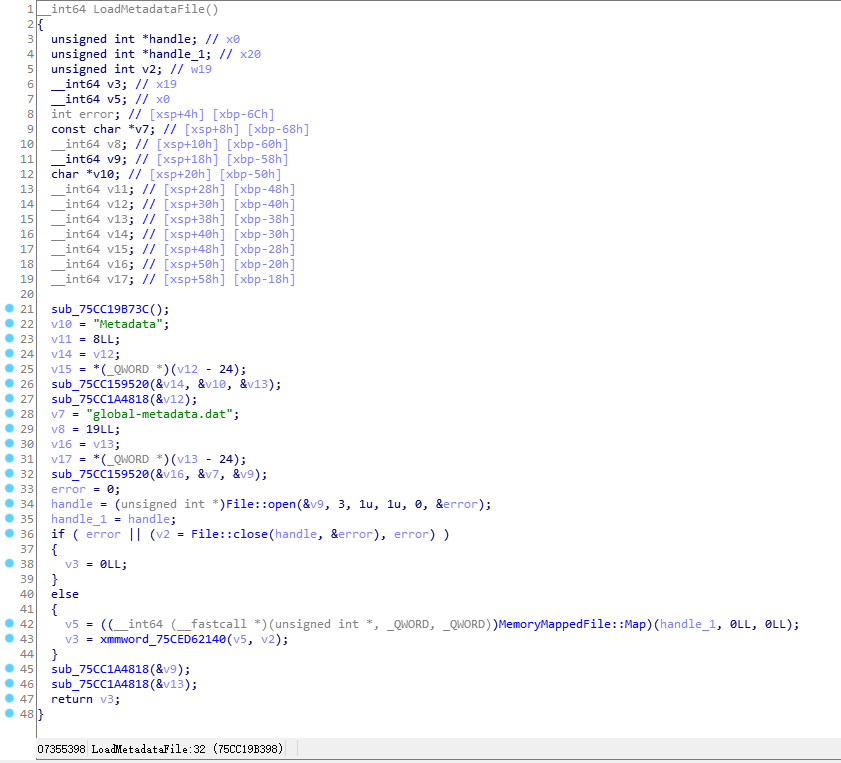
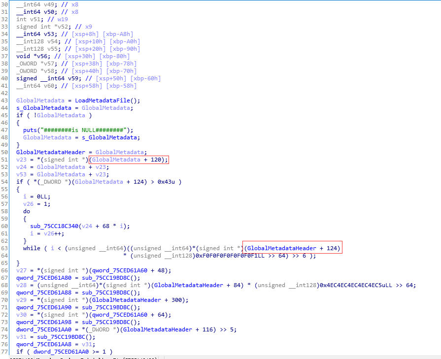
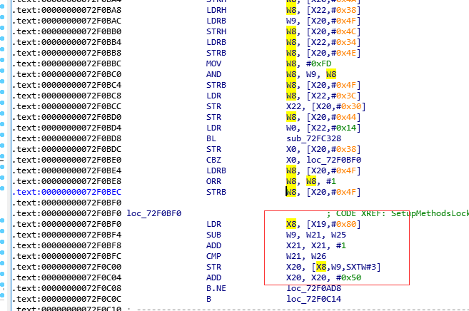
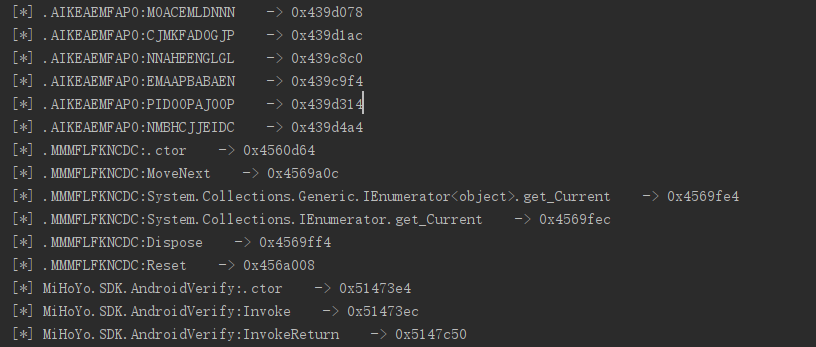

---

title: 使用frida获取il2cpp符号信息
date: 2020-12-04 15:55:31
tags: game
---

# 使用frida获取unity il2cpp符号信息

本次主角是米哈游的《原神》，起因还是在网上看到了一篇关于崩3的符号信息还原的文章，就想看看原神上有没有变化。

## 0x1 背景

本次分析选取的是android平台的，游戏采用unity开发，使用il2cpp模式编译。

使用 IL2CPP 模式编译，游戏中使用的字符串都被保存在了一个global-metadata.dat的资源文件里，只有在动态运行时才会将这些字符串读入内存。一般使用Il2CppDumper就可以读取global-metadata.dat文件中的信息，帮助反编译。

有破解就有保护，可能会遇到无法dump或者global-metadata.dat文件结构被修改的情况，无法使用Il2CppDumper，这个时候就需要自己动手了。

<!-- more -->

## 0x2 IL2CPP 加载过程

github上随便找一个il2cpp的源码，搜索global-metadata.dat，发现只有函数MetadataCache::Initialize()处使用。

```c++
void MetadataCache::Initialize()
{
    s_GlobalMetadata = vm::MetadataLoader::LoadMetadataFile("global-metadata.dat");
    s_GlobalMetadataHeader = (const Il2CppGlobalMetadataHeader*)s_GlobalMetadata;
    ...
        
 }
```

查看LoadMetadataFile代码：

```C++
void* MetadataLoader::LoadMetadataFile(const char* fileName)
{
    std::string resourcesDirectory = utils::PathUtils::Combine(utils::Runtime::GetDataDir(), utils::StringView<char>("Metadata"));

    std::string resourceFilePath = utils::PathUtils::Combine(resourcesDirectory, utils::StringView<char>(fileName, strlen(fileName)));

    int error = 0;
    FileHandle* handle = File::Open(resourceFilePath, kFileModeOpen, kFileAccessRead, kFileShareRead, kFileOptionsNone, &error);
    if (error != 0)
        return NULL;

    void* fileBuffer = utils::MemoryMappedFile::Map(handle);

    File::Close(handle, &error);
    if (error != 0)
    {
        utils::MemoryMappedFile::Unmap(fileBuffer);
        fileBuffer = NULL;
        return NULL;
    }

    return fileBuffer;
}
```

很明显，就是Initialize时调用LoadMetadataFile将global-metadata.dat映射到内存中。

还需要稍微了解一下global-metadata.dat文件结构。

```c++
struct Il2CppGlobalMetadataHeader
{
    int32_t sanity;
    int32_t version;
    int32_t stringLiteralOffset; // string data for managed code
    int32_t stringLiteralCount;
    int32_t stringLiteralDataOffset;
    int32_t stringLiteralDataCount;
    int32_t stringOffset; // string data for metadata
    int32_t stringCount;
    int32_t eventsOffset; // Il2CppEventDefinition
    int32_t eventsCount;
    int32_t propertiesOffset; // Il2CppPropertyDefinition
    int32_t propertiesCount;
    int32_t methodsOffset; // Il2CppMethodDefinition
    int32_t methodsCount;
    ...
}
```

## 0x3 某手游加载过程

反编译原神的il2cpp.so，loadmetadataFile()函数，对比原始loadmetadataFile，可以清楚的看到将文件映射进内存后进行了一次解密操作。（在MetadataCache::Initialize中）



再查看MetadataCache::Initialize()，根据红框，对比原始代码，可以发现global-metadata.dat文件结构已经被修改，即使成功dump文件也不能使用Il2CppDumper。



## 0x4 hook SetupMethodsLocked

为什么选择在SetupMethodsLocked hook，有其他大佬已经讲得很仔细了，可以参考[还原使用IL2CPP编译的unity游戏的symbol](https://www.nevermoe.com/2016/09/08/%e8%bf%98%e5%8e%9f%e4%bd%bf%e7%94%a8il2cpp%e7%9a%84symbol%ef%bc%88%e4%ba%8c%ef%bc%89/)

阅读源码,通过il2cpp_class_get_methods->Class::GetMethods->Class::SetupMethods跟踪到SetupMethodsLocked：

```c++
const MethodInfo* il2cpp_class_get_methods(Il2CppClass *klass, void* *iter)//导出函数很好找
{
    return Class::GetMethods(klass, iter);
}

 const MethodInfo* Class::GetMethods(Il2CppClass *klass, void* *iter)
    {
     ...
        if (!*iter)
        {
            Class::SetupMethods(klass);
            if (klass->method_count == 0)
                return NULL;
            *iter = &klass->methods[0];
            return klass->methods[0];
        }
   ...
   }

void Class::SetupMethods(Il2CppClass *klass)
{
    if (klass->method_count || klass->rank)
    {
        FastAutoLock lock(&g_MetadataLock);
        SetupMethodsLocked(klass, lock);
    }
}
```

```c++

void SetupMethodsLocked(Il2CppClass *klass, const FastAutoLock& lock)
    {
        if ((!klass->method_count && !klass->rank) || klass->methods)
            return;

        if (klass->generic_class)
        {
            InitLocked(GenericClass::GetTypeDefinition(klass->generic_class), lock);
            GenericClass::SetupMethods(klass);
        }
        else if (klass->rank)
        {
            InitLocked(klass->element_class, lock);
            SetupVTable(klass, lock);
        }
        else
        {
            if (klass->method_count == 0)
            {
                klass->methods = NULL;
                return;
            }

            klass->methods = (const MethodInfo**)IL2CPP_CALLOC(klass->method_count, sizeof(MethodInfo*));
            MethodInfo* methods = (MethodInfo*)IL2CPP_CALLOC(klass->method_count, sizeof(MethodInfo));
            MethodInfo* newMethod = methods;

            MethodIndex start = klass->typeDefinition->methodStart;
            IL2CPP_ASSERT(start != kFieldIndexInvalid);
            MethodIndex end = start + klass->method_count;

            for (MethodIndex index = start; index < end; ++index)
            {
                const Il2CppMethodDefinition* methodDefinition = MetadataCache::GetMethodDefinitionFromIndex(index);

                newMethod->name = MetadataCache::GetStringFromIndex(methodDefinition->nameIndex);
                newMethod->methodPointer = MetadataCache::GetMethodPointerFromIndex(methodDefinition->methodIndex);
                newMethod->invoker_method = MetadataCache::GetMethodInvokerFromIndex(methodDefinition->invokerIndex);
                newMethod->declaring_type = klass;
                newMethod->return_type = MetadataCache::GetIl2CppTypeFromIndex(methodDefinition->returnType);

                ParameterInfo* parameters = (ParameterInfo*)IL2CPP_CALLOC(methodDefinition->parameterCount, sizeof(ParameterInfo));
                ParameterInfo* newParameter = parameters;
                for (uint16_t paramIndex = 0; paramIndex < methodDefinition->parameterCount; ++paramIndex)
                {
                    const Il2CppParameterDefinition* parameterDefinition = MetadataCache::GetParameterDefinitionFromIndex(methodDefinition->parameterStart + paramIndex);
                    newParameter->name = MetadataCache::GetStringFromIndex(parameterDefinition->nameIndex);
                    newParameter->position = paramIndex;
                    newParameter->token = parameterDefinition->token;
                    newParameter->customAttributeIndex = parameterDefinition->customAttributeIndex;
                    newParameter->parameter_type = MetadataCache::GetIl2CppTypeFromIndex(parameterDefinition->typeIndex);

                    newParameter++;
                }
                newMethod->parameters = parameters;

                newMethod->customAttributeIndex = methodDefinition->customAttributeIndex;
                newMethod->flags = methodDefinition->flags;
                newMethod->iflags = methodDefinition->iflags;
                newMethod->slot = methodDefinition->slot;
                newMethod->parameters_count = static_cast<const uint8_t>(methodDefinition->parameterCount);
                newMethod->is_inflated = false;
                newMethod->token = methodDefinition->token;
                newMethod->methodDefinition = methodDefinition;
                newMethod->genericContainer = MetadataCache::GetGenericContainerFromIndex(methodDefinition->genericContainerIndex);
                if (newMethod->genericContainer)
                    newMethod->is_generic = true;

                klass->methods[index - start] = newMethod;

                newMethod++; //在这里hook，就可以轻松拿到全部MethodInfo
            }
        }
    }
```

MethodInfo、Il2CppClass的结构也需要了解一下：

```c++
struct Il2CppClass
{
    const Il2CppImage* image;
    void* gc_desc;
    const char* name;
    const char* namespaze;
    ... 
}
struct MethodInfo
{
    Il2CppMethodPointer methodPointer;
    InvokerMethod invoker_method;
    const char* name;
    Il2CppClass *declaring_type;
    const Il2CppType *return_type;
    const ParameterInfo* parameters;
  ...
};
```

反编译获取hook地址：



编写frida js：

```js
// hook SetupMethodsLocked
var module = Process.findModuleByName("libil2cpp.so");
var p_size = 8;
Interceptor.attach(ptr(module.base).add(0x72F09EC).add(0x204),{
    onEnter:function(args){
    var newMethod = this.context.x20
    var pointer = newMethod.readPointer(); //MethodInfo
    var name = newMethod.add(p_size * 2).readPointer().readCString();
    var klass = newMethod.add(p_size * 3).readPointer();//Il2CppClass
    var klass_name = klass.add(p_size * 2).readPointer().readCString();
    var klass_paze = klass.add(p_size * 3).readPointer().readCString();
    send(klass_paze+"."+klass_name+":"+name+"    -> "+pointer.sub(module.base));
    }
});
```

成功hook，但是你会发现，跟本没什么卵用。因为它被混淆了。。。。

  

## 参考

1.  [[unity]Real-time Dump](https://floe-ice.cn/archives/502)
2.  [[Honkai 3rd]v3.5符号还原](https://blog.palug.cn/2376.html)

