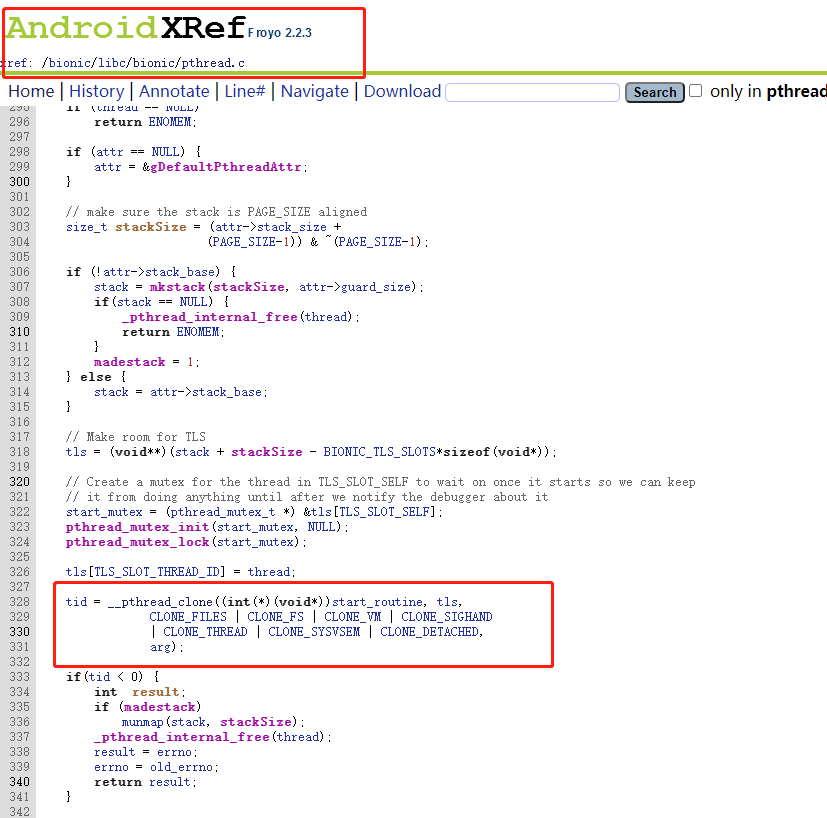

# 虚拟执行使用笔记

起因是遇到一个可执行文件被加壳了，运行时间很短，无法在运行时dump。因为是商业的免费壳，带上了反调试，使用ida脱壳过程也比较麻烦。想尝试一种方便简单易上手的脱壳方式。

这种情况，模拟执行是最好的解决方式。所以优先尝试了AndroidNativeEmu。

<!-- more -->

## AndroidNativeEmu 初探

根据项目中给出的实例代码，写出了如下代码：

```python
import logging
import sys
from androidemu.emulator import Emulator


logging.basicConfig(
    stream=sys.stdout,
    level=logging.DEBUG,
    format="%(asctime)s %(levelname)7s %(name)34s | %(message)s"
)

logger = logging.getLogger(__name__)

#初始化虚拟机
emulator = Emulator(vfp_inst_set=True)

#加载需要的依赖库
emulator.load_library("bin/linker64", do_init=False)
emulator.load_library("bin/libdl.so", do_init=False)
emulator.load_library("bin/libc.so", do_init=False)
emulator.load_library("bin/libc++.so", do_init=False)
emulator.load_library("bin/libm.so", do_init=False)
emulator.load_library("bin/liblog.so", do_init=False)
emulator.load_library("bin/libz.so", do_init=False)
emulator.load_library("bin/libnetd_client.so", do_init=False)

#加载目标文件
lib_module = emulator.load_library("bin/Target", do_init=True)

for module in emulator.modules:
    logger.info("=> 0x%08x - %s" % (module.base, module.filename))

emulator.call_native(lib_module.init_proc,0,0,0)
for s in lib_module.symbols:
    print(s)
```

运行，竟然报错：


跟踪加载函数load_library，可以发现只执行了init_array,但是目标elf是有init段的。直接init_array肯定是没解密的：


所以在emulator.py中，增加init段相关的执行函数：

```python
    def load_library(self, filename, do_init=True):
        libmod = self.modules.load_module(filename)
        if do_init:
            logger.debug("Calling init for: %s  init_proc %x " % (filename,libmod.init_proc))
            if libmod.init_proc != 0: #新增
                self.call_native(libmod.init_proc,0,0,0)
            for fun_ptr in libmod.init_array:
                logger.debug("Calling Init function: %x " % fun_ptr)
                self.call_native(fun_ptr, 0, 0, 0)
        return libmod
```

在internal/modules.py中增加init段的解析：

```python
#在load_module中，解析DYNAMIC的时候添加
for x in elf.iter_segments():
    if x.header.p_type == "PT_DYNAMIC":
        for tag in x.iter_tags():
            if tag.entry.d_tag == "DT_INIT_ARRAYSZ":
                init_array_size = tag.entry.d_val
                elif tag.entry.d_tag == "DT_INIT_ARRAY":
                    init_array_offset = tag.entry.d_val
                    elif tag.entry.d_tag == "DT_INIT": #新增
                        init_proc = tag.entry.d_val +load_base
                        
#Module初始化时，添加一下self.init_proc = init_proc
```

运行，任然报错：


有一点无计可施，所以经推荐换上了unidbg。

## unidbg 初探

同样，也是根据示例代码编写如下代码：

```java
public class runELF  {
    private static final Log log = LogFactory.getLog(runELF.class);
    public final AndroidEmulator emulator;
    public final VM vm;


    public runELF(File executable) {
        this.emulator = AndroidEmulatorBuilder
                .for64Bit()
                .setProcessName(executable.getName())
                .build();
        Memory memory = emulator.getMemory();
        LibraryResolver resolver = new AndroidResolver(23);
        memory.setLibraryResolver(resolver);
        vm = emulator.createDalvikVM();
        vm.setVerbose(true);
        new AndroidModule(emulator, vm).register(memory);

    }


    public static void main(String[] args){

//        File executable = new File("E:\\github\\AndroidNativeEmu\\androidELF\\bin\\Target");
        File executable = new File("C:\\Users\\yangtong02\\Desktop\\AndroidElf\\Target");
        runELF run = new runELF(executable);
        DalvikModule dm = run.vm.loadLibrary(executable,true);
        Module cm = dm.getModule();
        log.info(String.format("%s   %x  %x  ", cm.name,cm.base,cm.size));
        
        byte[] dumpData = run.emulator.getBackend().mem_read(cm.base, cm.size);
        bytesToFile(dumpData, "dump_path");
       
        cm.callEntry(run.emulator);
    }
}

```


至此，dump是成功了，但是在使用过程中，留下了许多无法理解的坑。

##### 坑1：文件必须在C盘中，否则报错


##### 坑2：AndroidResolver版本为19时


要知道为什么19不可以，23可以，就得分析一下这个AndroidResolver到底是个什么东西。


如图，可以看出这就是在dlopen中，对加载的so进行处理的一个函数，加载依赖库也会进行处理。


为什么一个处理__pthread_clone函数，一个处理clone呢，具体还是要到Android源码里寻找问题。

高版本：


而低版本处理：




总结：

AndroidResolver是处理所有so中关于线程操作的类（主要是pthread_create和pthread_join）。这个类有两个模式，也是因为libc中低版本pthread_create是调用 __pthread_clone，而高版本中是clone。且低版本只支持处理32位的libc。

