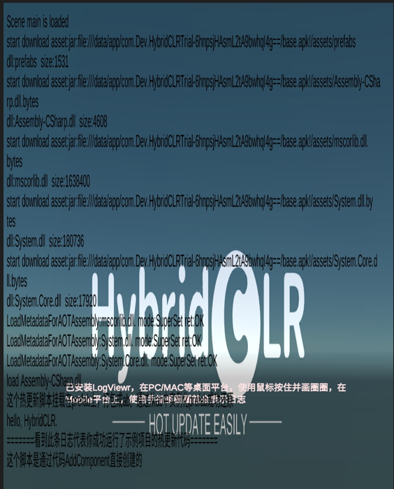
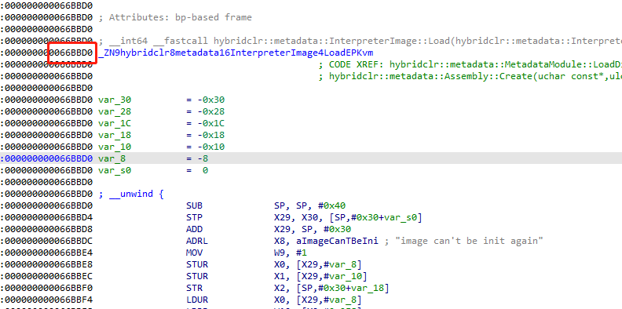
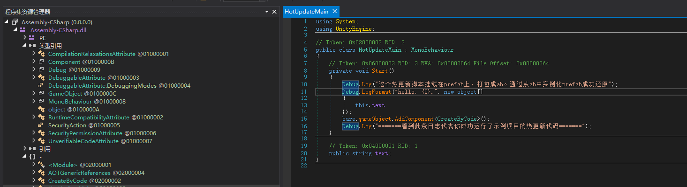
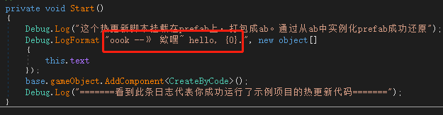
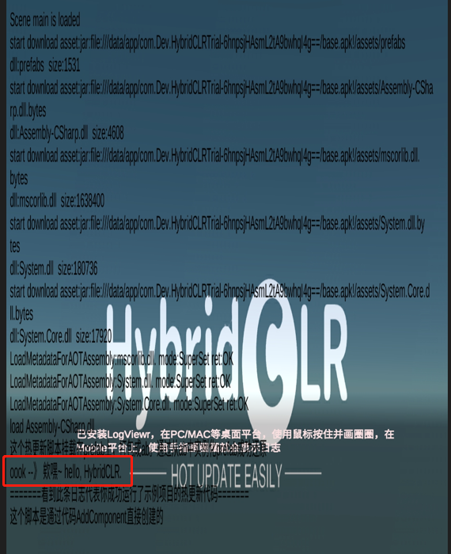

# 如何修改unity HybridCLR 热更dll

## 背景

由于很多原因比如修bug、减小包体积、迅速更新，游戏需要使用到热更。

目前比较热门的热更方法，一种是使用lua，比如xlua、tolua之类的，还有一种是使用热更框架，比如HybridCLR、ILRuntime。

如何修改lua，已经有很多文章了，证明了使用lua被篡改是很简单的一件事。那么，热更框架就安全了吗？

<!-- more -->

## HybridCLR dump and modify

项目地址：https://github.com/focus-creative-games/hybridclr

不得不说，通过阅读文档，这个框架是修改了il2cpp来实现的原生级热更，真的是很厉害。

原生的unity il2cpp是将游戏所有代码编译到libil2cpp.so，不会生成Assembly-CSharp.dll。

首先在github上拉取**测试demo**，并打包成apk，运行起来截图：



我们可以看到游戏加载了热更的Assembly-CSharp.dll，并且输出hello，HybridCLR。

可以通过查找字符串“image can’t be init again”来获取加载函数，找到这个函数并hook，就能将热更的dll dump下来，修改内容后并重新加载进去。





修改dll内容：



重新加载dll：



附上frida js

```js
//唯一需要修改的信息为InterpreterImage::load的偏移
let so = Process.findModuleByName("libil2cpp.so")
while (so == null)
    so = Process.findModuleByName("libil2cpp.so")

let i = 1;
Interceptor.attach(so.base.add(0x66BBD0),{
    onEnter:function (args) {
        let filePath = "/data/data/com.Dev.HybridCLRTrial/dump_"+i+".dll"
        if(access(filePath) == 0 ){
            var data = read(filePath);
            args[1] = data.data;
            args[2] = new NativePointer(ptr(data.size));
            console.log("load "+filePath)
        }else {
            const dumpfile = new File(filePath, "wb");
            let size = args[2]
            dumpfile.write( args[1].readByteArray(size.toInt32()))
            console.log("dump "+filePath)
        }


        i++
    }
})


function access(filePath){
    var ptr_access = Module.findExportByName("libc.so","access");
    var func_access = new NativeFunction(ptr_access,'int',['pointer','int']);
    var ptr_filepath = Memory.allocUtf8String(filePath);
    var ret = func_access(ptr_filepath,0);
    return ret;
}

function mkdir(Path){
    var ptr_mkdir = Module.findExportByName("libc.so","mkdir");
    var func_mkdir = new NativeFunction(ptr_mkdir,'int',['pointer','int']);
    var ptr_filepath = Memory.allocUtf8String(Path);
    var ret = func_mkdir(ptr_filepath,777);
    return ret;
}

function folder_mkdirs(p){
    var p_list = p.split("/");
    var pp = "/sdcard/fridadump/lua";
    for(var i = 0;i< p_list.length  ;i++){
        pp = pp + "/" + p_list[i];
        if(access(pp) != 0){
            var x = mkdir(pp)
            send("mkdir :"+pp+"ret :" +x);
        }
    }

}
// frida file 对象没有read
function read(filePath){
    var ptr_open = Module.findExportByName("libc.so","open");
    const open = new NativeFunction(ptr_open,'int',['pointer','int']);

    var ptr_read = Module.findExportByName("libc.so","read");
    const read = new NativeFunction(ptr_read,'int',['int','pointer','int']);

    var ptr_close = Module.findExportByName("libc.so","close");
    const close = new NativeFunction(ptr_close,'int',['int']);

    var fd = open(Memory.allocUtf8String(filePath),0);
    var size = get_file_size(fd);
    if(size >0){
        var data = Memory.alloc(size + 5);
        if( read(fd,data,size) <0){
            console.log('[+] Unable to read DLL [!]');
            close(fd);
            return 0;
        }
        close(fd);
        return {data:data,size:size};
    }

}

function get_file_size(fd){
    var statBuff = Memory.alloc(500);
    var fstatSymbol = Module.findExportByName('libc.so', 'fstat');
    var fstat = new NativeFunction(fstatSymbol, 'int', ['int', 'pointer']);
    if(fd > 0) {
        var ret = fstat(fd, statBuff);
        if(ret < 0) { console.log('[+] fstat --> failed [!]');
        }
    }
    var size = Memory.readS32(statBuff.add(0x30));
    if(size > 0) {
        return size;
    } else {
        return 0;
    }
}
```

如此就完成了关于使用HybridCLR 游戏的热更dll修改。其他逻辑信息就通过常规的分析il2cpp取获取。