# 爬取抖音评论

## 一、使用burp抓包安卓模拟器

随着android版本的更新，在真机上抓包越来越难，总是遇到格式各样的问题，导致抓不了包。所以选择模拟器可以避免很多没必要的坑。

我抓包使用burp，同理你可以使用Charles、Fiddler，模拟器我使用夜神，你可以用任意的模拟器。

下载、安装之类的默认已完成，快速的配置代理信息。

<!-- more -->

###  Burp Suite代理端设置

Proxy——>Options——>Proxy Listeners中点击add

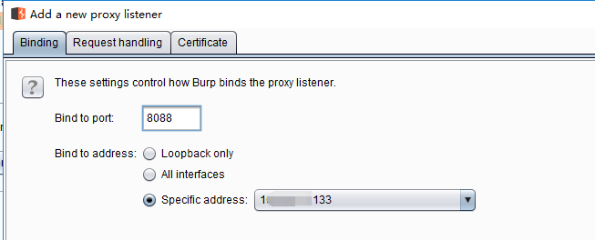

###  模拟器设置

找到网络，然后修改网络（与真机相同）

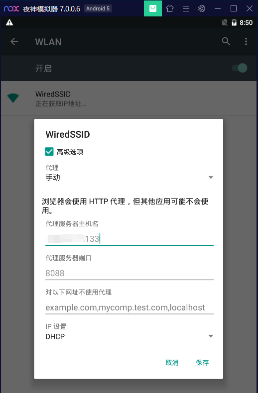

### 安装证书

打开浏览器，访问http://burp，点击黑框下载证书

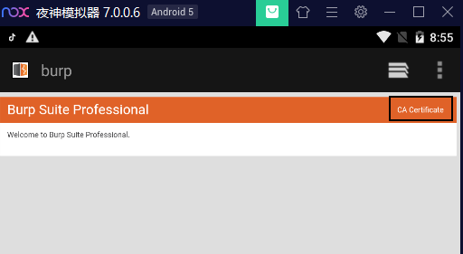

下载的证书在/sdcard/Download目录下，**将cacert.der改名为cacert.cer**

设置->安全->从SD卡安装证书，找到cacert.cer,安装成功即可。

查看 信任的凭据，包含PortSwigger即可。

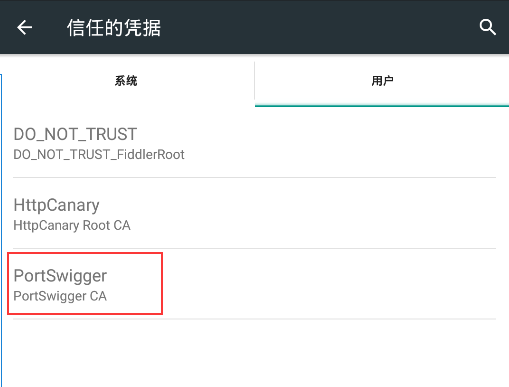

随便找一个视频，打开评论，就可以看到抓包内容如下：

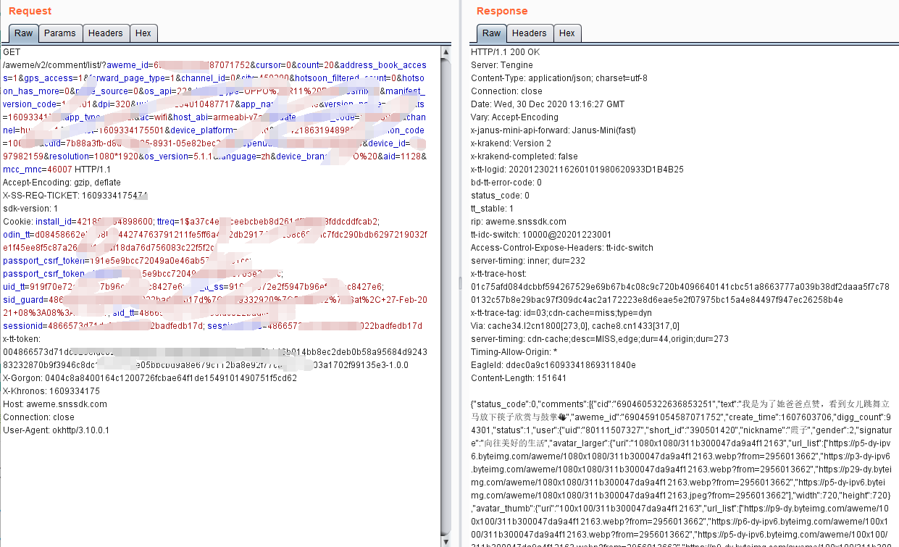

## 二、x-gorgon 签名

由上图，可以看到x-gorgon开头四位是0404，也是说使用的是0404版本的x-gorgon签名算法。

关于调用so生成x-gorgon签名网上的各路大佬真是各显神通。

我个人比较喜欢的两种方法：

1.[unidbg调用so生成xgorgon](https://segmentfault.com/a/1190000023651902)

2.[AndServer+Service 打造 Android 服务器调用 so](https://github.com/Breathleas/HttpSo-1)

###  签名生成

首先我们需要知道x-gorgon签名怎么生成的，才能使用各种厉害的工具调用libcms.so生成x-gorgon。

找到旧版本的抖音，将apk丢进jadx中反编译，并且查找gorgon，就能发现一个init_gorgon函数。

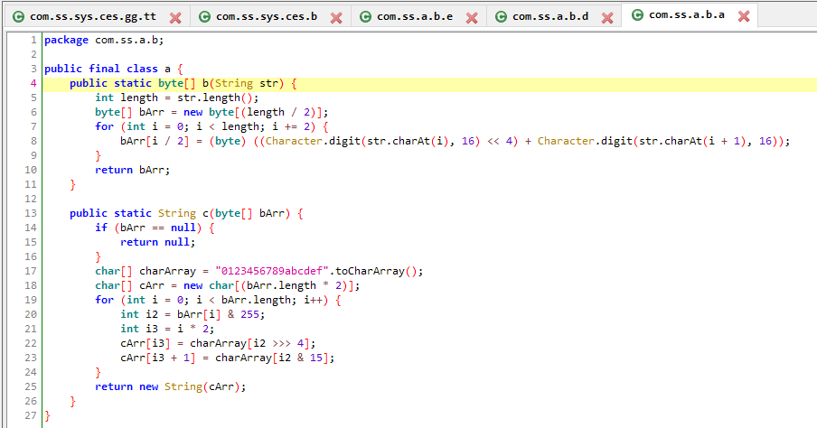

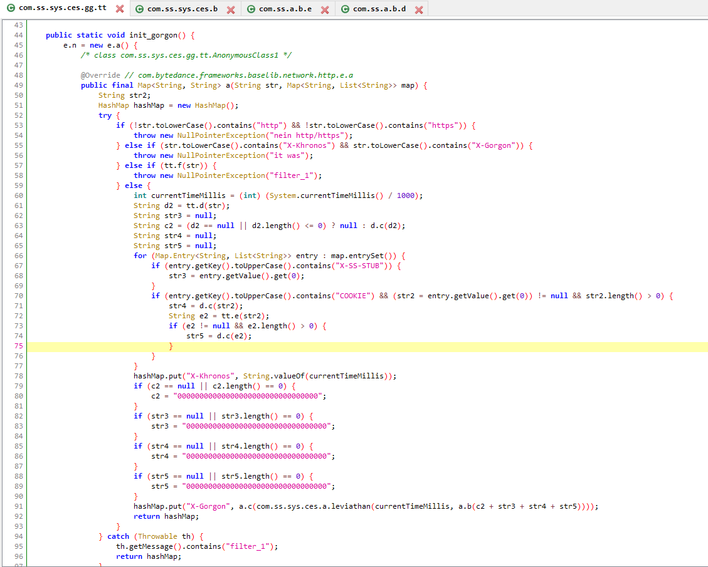


根据91行伪代码（com.ss.sys.ces.gg.tt.init_gorgon）可以知道，生成X-Gorgon需要调用com.ss.sys.ces.a.leviathan函数，传入时间，c2（获取url中参数）、str3（X-SS-STUB）、str4（COOKIE）、str5（sessionid）。

查看com.ss.sys.ces.a.leviathan函数，可以看到是调用libcms.so中的leviathan函数。

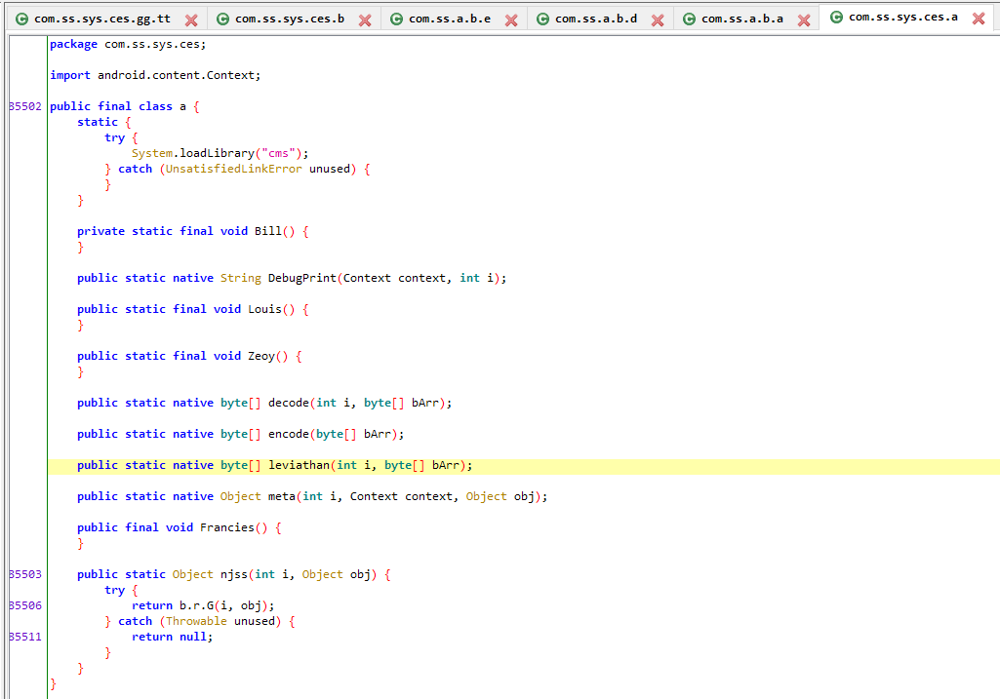

所以还原的java的代码如下,，剩下的工具类可以直接粘贴伪代码：

```java
public static String init_Gorgon(String url, HashMap<String, String> headers) {
        String urlParams = getUrlParams(url);
        String URL = encryptData(urlParams);
        long rticket = System.currentTimeMillis();
        if (url.contains("rticket")) {
            rticket = Long.parseLong(getTime(url));
        }
        int ks = Integer.parseInt(Long.toString(rticket / 1000));
        String X_SS_STUB = null;
        String COOKIE = null;
        String SESSION_ID = null;
        for (HashMap.Entry<String, String> iterator : headers.entrySet()) {
            if (iterator.getKey().toUpperCase().contains("X-SS-STUB")) {
                X_SS_STUB = iterator.getValue();
            }
            if (iterator.getKey().toUpperCase().contains("COOKIE")) {
                String cookie = iterator.getValue();
                if (cookie != null && cookie.length() > 0) {
                    COOKIE = encryptData(cookie);
                    String sessionId = getSessionId(cookie);
                    if (sessionId != null && sessionId.length() > 0) {
                        SESSION_ID = encryptData(sessionId);
                    }
                }
            }
        }
        if (URL == null || URL.length() <= 0) {
            URL = "00000000000000000000000000000000";
        }
        if (X_SS_STUB == null || X_SS_STUB.length() <= 0) {
            X_SS_STUB = "00000000000000000000000000000000";
        }
        if (COOKIE == null || COOKIE.length() <= 0) {
            COOKIE = "00000000000000000000000000000000";
        }
        if (SESSION_ID == null || SESSION_ID.length() <= 0) {
            SESSION_ID = "00000000000000000000000000000000";
        }
        return com.ss.a.b.a.c(com.ss.sys.ces.a.leviathan( ks, com.ss.a.b.a.b(URL + X_SS_STUB + COOKIE + SESSION_ID)));
    }
```

### 工具使用

上面分析了x-gorgon的生成，这里没必要重复造轮子，所以可以直接使用大佬分享的工具。本次使用的是 [AndServer+Service 打造 Android 服务器调用 so](https://github.com/Breathleas/HttpSo-1)

1. 使用方法也非常简单，拉取github上代码，编译成apk。

2. 安装apk，点击开启服务，web端口为8888（也可以在代码里配置），如下图：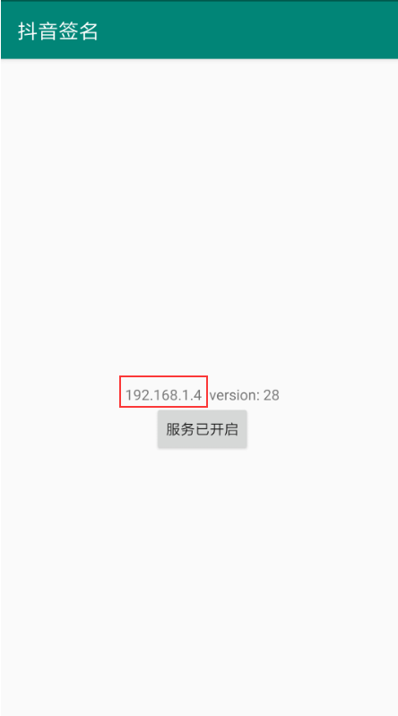


3. 下图为请求某一视频下的前20条评论，长度为123649：

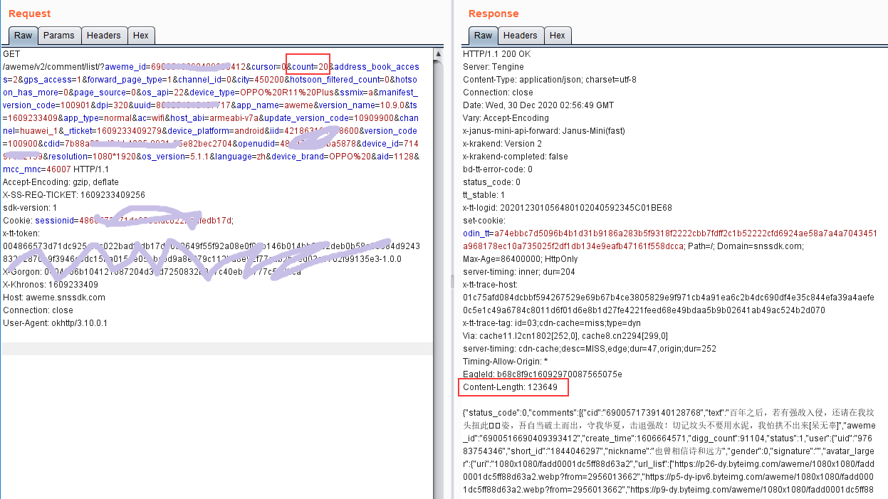

修改count，不修改X-Gorgon，则请求失败：

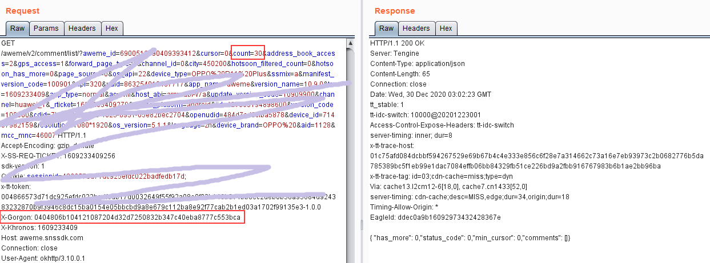

4. 获取修改后的url，请求http://<ip>:8888/url 计算X-Gorgon：


5.   修改x-gorgon，并再次请求，则成功得到30条评论数据，长度为179535：

   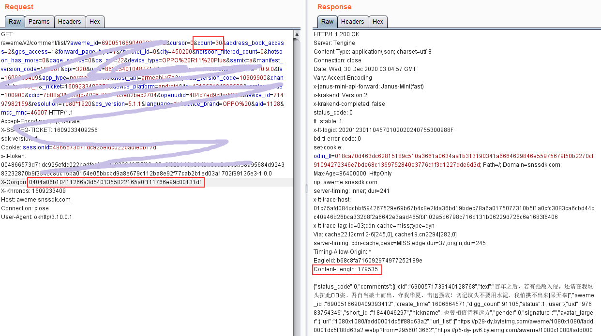

## 三、简易DEMO

```python
import json
import time
import requests
import urllib3


def GetGorgon(url):
    return requests.post("http://192.168.1.11:8888/url", data=url).text


def RequestDY(url,headers):
    http = urllib3.PoolManager()
    response = http.request('GET', url, headers=headers)
    jsonstr = json.loads(response.data)
    return parseResponse(jsonstr)


def parseResponse(jsonstr):
    comments = jsonstr["comments"]
    for com in comments:
        text = str(com["text"])
        user = str(com["user"]["nickname"])
        create_time = com["create_time"]
        timeArray = time.localtime(create_time)
        dt = time.strftime("%Y-%m-%d %H:%M:%S", timeArray)
        print(" {0}({1}) : {2}".format(user, dt, text))
    return len(comments)

def main():

    cookies = "sessionid=xxxxxx;"
    rticket = 1610184006498
    Token = "xxxxxx"
    headers = {
        "Accept-Encoding": "gzip, deflate",
        "sdk-version": "1",
        "Cookie": cookies,
        "Host": "aweme.snssdk.com",
        "Connection": "close",
        "User-Agent": "okhttp/3.10.0.1",
        "X-Gorgon": "",
        "X-Khronos": str(int(rticket / 1000)),
        "X-Tt-Token": Token,
        "X-SS-REQ-TICKET": 1610184006483,
        "passport-sdk-version": 19,
        "sdk-version": 2,

    }

    cursor = 0
    count = 20
    url = "https://aweme.snssdk.com/aweme/v2/comment/list/?aweme_id=xxx&cursor={0}&count={1}&address_book_access=1...".format(cursor, count)
    gorgon  = GetGorgon(url)
    headers["X-Gorgon"] = gorgon
    while(RequestDY(url,headers)>0):
        cursor  = cursor + count
        url = "https://aweme.snssdk.com/aweme/v2/comment/list/?aweme_id=xxx&cursor={0}&count={1}&address_book_access=1...".format(cursor, count)
        gorgon = GetGorgon(url)
        headers["X-Gorgon"] = gorgon
        
if __name__ == '__main__':
    main()
```

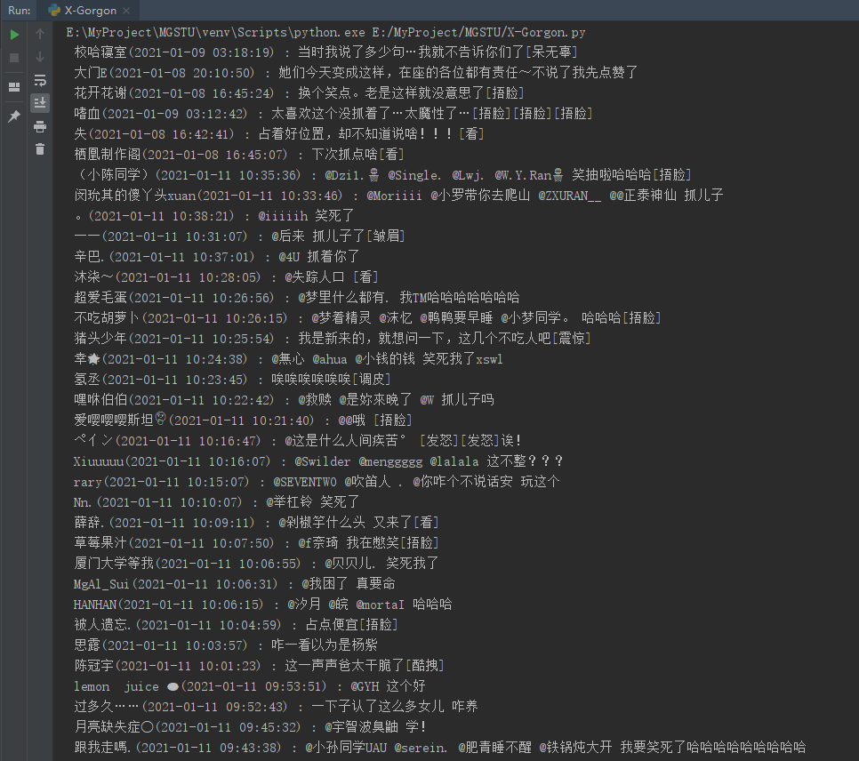

### 最后

简易demo只获取了视频下的评论，对于单条评论下的评论并没有爬取，有需求的小伙伴自己做一做也不难的~