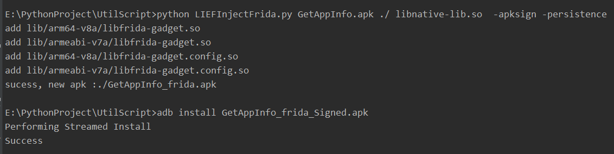
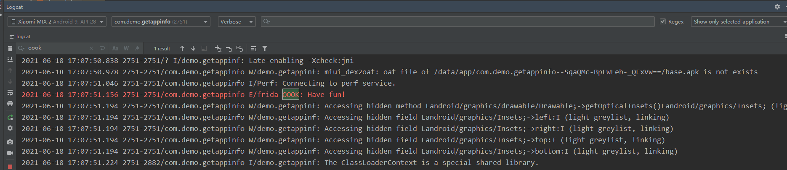
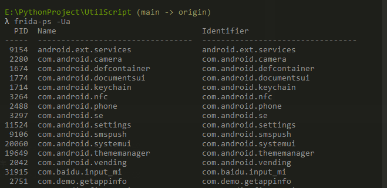
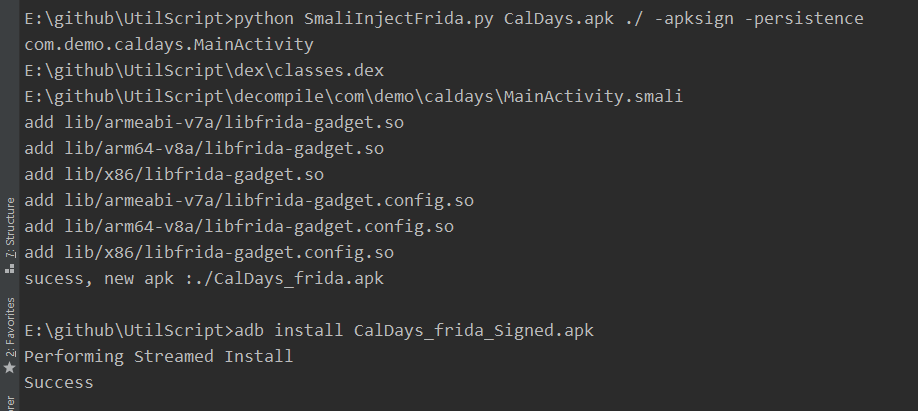
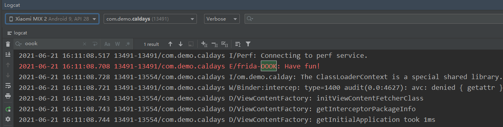
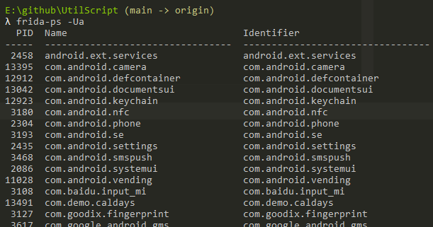
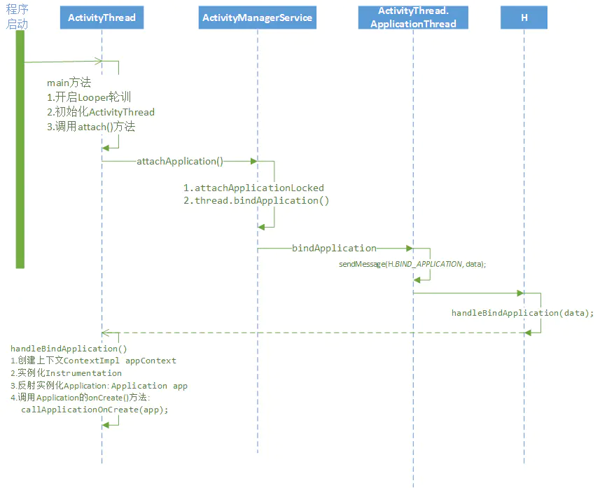

# 非root环境下frida持久化的两种方式及脚本

frida是一个非常好用的hook框架，但使用中有两个问题，一是非root手机使用挺麻烦的，二是frida相较于其他HOOK框架没那么持久。网上的持久化大多基于xposed、刷ROM或者是virtualapp，前面两个是比较重量级，不够轻便。虚拟化技术本身就自带风险，很容易被检测到。

在Android端，网上教程里大部分都是使用frida server来进行hook，其实还有一种使用方法为 frida gadget，此方法需要将frida-gadget.so注入到apk中，纯手动的话过于麻烦，所以这里实现两个脚本，分别用修改smali、修改so来注入目标。


**我使用的frida-gadget版本为14.2.18。有其他版本的需求，需要替换tools下的so文件**

## 方法一 调试apk中含有so

此方法相对简单。原理来自于古早的静态注入方式：[Android平台感染ELF文件实现模块注入](https://gslab.qq.com/portal.php?mod=view&aid=163)

而这种注入方式有工具可以快速实现：[How to use frida on a non-rooted device](https://lief.quarkslab.com//doc/latest/tutorials/09_frida_lief.html)

该方法优点在于可以让gadget是第一个启动的，缺点是没有so的apk不能用

<!-- more -->

### 1.效果

首先运行注入脚本，获得注入且重签名后的apk。直接安装。



将frida_script.js push 到/data/local/tmp。frida_script.js为你的hook代码：

```js
Java.perform(function () {
  var Log = Java.use("android.util.Log");
  Log.e("frida-OOOK", "Have fun!");
});//android 不要使用console.log
```

打开app即可看到效果，app每次启动都会成功的打印LOG。：



不想使用持久化（本地js脚本），也可以通过电脑连接：



不使用持久化，就不必添加config文件，所以脚本执行不需要执行-persistence，执行下面的就可以：

```shell
python LIEFInjectFrida.py apkfile  outdir  libnative-lib.so  -apksign 
```


### 2.代码

工具详细代码：https://github.com/nszdhd1/UtilScript/blob/main/LIEFInjectFrida.py

运行脚本记得安装lief（pip install lief）

其实关键代码就几行：


```python

    for soname in injectsolist: #遍历apk中指定SO有哪几种架构，并添加gadget.so为依赖库。
        if soname.find("x86") != -1:
            continue
        so = lief.parse(os.getcwd()+"\\"+soname)
        so.add_library("libfrida-gadget.so")
        so.write(soname+"gadget.so")
```

##  方法二  apk中没有so

在实际情况下，并不是所有的apk都有so。没有so，方法一便没有用武之地了。

此方法呢，是通过修改smali，调用System.loadLibrary来加载so。该原理更简单，但是有一个弊端就是时机不够靠前，没有办法hook Activity 启动之前的代码。

手动修改太麻烦，还是写一个脚本自动化注入。

此方法优点是原理简单，缺点是脚本实现麻烦，容易写bug

### 1. 效果

首先运行注入脚本，获得注入且重签名后的apk。直接安装。





frida_script.js代码同上，同样也可以使用电脑连接：



### 2. 代码

工具详细代码：https://github.com/nszdhd1/UtilScript/blob/main/SmaliInjectFrida.py

关键代码：

```python
    def get_launchable_activity_aapt(self): #通过aapt找到apk的启动activity
        aapt_path = os.path.join(self.toolPath, 'aapt.exe')
        cmd = '%s dump badging "%s" ' % (aapt_path, self.apkpath)
        p = subprocess.Popen(cmd, stdin=subprocess.PIPE, stdout=subprocess.PIPE, stderr=subprocess.PIPE, shell=True)
        out,err = p.communicate()
        cmd_output = out.decode('utf-8').split('\r')
        for line in cmd_output:
            #正则，pattern.search正常，pattern.match就会有问题=-=懒得解决了
            pattern = re.compile("launchable-activity: name='(\S+)'")
            match = pattern.search(line)
            if match:
                # print match.group()[27:-1]
                return match.group()[27:-1]
           
    def injectso(self):
        target_activity = self.get_launchable_activity_aapt()
        for dex in self.dexList:
            print(dex)
            if self.dexDecompile(dex):
                smali_path = os.path.join(self.decompileDir,target_activity.replace('.','\\'))+".smali"
                print(smali_path)
                with open(smali_path, 'r') as fp:
                    lines = fp.readlines()
                    has_clinit = False
                    start = 0
                    for i in range(len(lines)):  
                        #start是获取smali中，可以添加代码的位置
                        if lines[i].find(".source") != -1:
                            start = i
                        #找到初始化代码
                        if lines[i].find(".method static constructor <clinit>()V") != -1:
                            if lines[i + 3].find(".line") != -1:
                                code_line = lines[i + 3][-3:]
                                lines.insert(i + 3, "%s%s\r" % (lines[i + 3][0:-3], str(int(code_line) - 2)))
                                print("%s%s" % (lines[i + 3][0:-3], str(int(code_line) - 2)))
                                #添加相关代码
                                lines.insert(i + 4, "const-string v0, \"frida-gadget\"\r")
                                lines.insert(i + 5,
                                             "invoke-static {v0}, Ljava/lang/System;->loadLibrary(Ljava/lang/String;)V\r")
                                has_clinit = True
                                break
                    #如果碰上本身没有clinit函数的apk，就需要自己添加
                    if not has_clinit:
                        lines.insert(start + 1, ".method static constructor <clinit>()V\r")
                        lines.insert(start + 2, ".registers 1\r")
                        lines.insert(start + 3, ".line 10\r")
                        lines.insert(start + 4, "const-string v0, \"frida-gadget\"\r")
                        lines.insert(start + 5,
                                     "invoke-static {v0}, Ljava/lang/System;->loadLibrary(Ljava/lang/String;)V\r")
                        lines.insert(start + 6, "return-void\r")
                        lines.insert(start + 7, ".end method\r")

                    with open(smali_path, "w") as fp:
                        fp.writelines(lines)
                self.dexCompile(dex)
```

## Frida 持久化检测特征

我因为方便，将frida js 放在了/data/local/tmp下，如果直接放在app的沙箱下，这就是一个稳定的hook框架了。

既然做了持久化，就要从防御者角度看看哪些方面可以检测到应用被注入了。

首先，当然是内存中会有frida-gadget.so。但这个so可以被重命名（我可以命名为常见的模块，比如libBugly.so），所以检测/proc/pid/maps下是否有frida-gadget并不准确。因为frida有一个config文件，是持久化必须存在的。所以检测libs下是否有lib\*.so和lib\*.config.so是一种较为可行的方法。但是，如果你不使用持久化，或者去github上找到frida的源码修改gaget.vala（ps.这一点是合理的猜想，还未验证过），就可以让防御者检测不到。

```c
#gaget.vala 代码片段
if ANDROID
		if (!FileUtils.test (config_path, FileTest.EXISTS)) {
			var ext_index = config_path.last_index_of_char ('.');
			if (ext_index != -1) {
				config_path = config_path[0:ext_index] + ".config.so";#修改这里，就可以检测不到。需要保持后缀不变（例如改成symbols.so）
			} else {
				config_path = config_path + ".config.so";
			}
		}
#endif
```

除去端口检测这种几乎没什么用的，还有一中是内存扫描，扫描内存中是否有LIBFRIDA_GADGET关键词，具体实现网上有教程。

## 系统级注入记录

优点：不需要进行签名校验对抗

缺点：限制较多，随着安卓版本升级，需要root地方较多。

### 1.修改Android源码framework注入

拉取和手机版本相对应的AOSP。

原因如图：




 frameworks/base/core/java/android/app/ActivityThread.java，函数handleBindApplication最开始添加如下代码，并mm framework/base

```java
File HookConfig  = new File("/data/local/tmp/OOOK.config");
if(HookConfig.exists()&&HookConfig.isFile()){
    try {
        FileReader reader = new FileReader(HookConfig);
        BufferedReader bufferedReader = new BufferedReader(reader);
        String target_pack = bufferedReader.readLine();
        if(target_pack !=null){
            if(data.processName.equals(target_pack)) {
                String soPath = bufferedReader.readLine();
                if (soPath != null) {
                    Log.e("OOOK",target_pack+" load :"+soPath);
                    System.load(soPath);
                }
            }
        }
        bufferedReader.close();
        reader.close();
    } catch (FileNotFoundException e) {
        e.printStackTrace();
    } catch (IOException e) {
        e.printStackTrace();
    }

}

"""
OOOK.config中
com.demo.xx
/data/local/tmp/libfrida-gadget.so
"""
```

坑1: 只有低版本Android（9以下）模拟器 支持 adb remount 命令修改 /system 权限。而真机需要root。

坑2：会有读取/data/local/tmp Permission denied，目标apk没有读写文件权限会比较麻烦。

### 2.修改system.img镜像/system/lib

在$ANDROID_SDK/system-images/android-apilevel/google_apis_playstore/x86下可以拿到Android模拟器的system.img

先解压，将libfrida-gadget.so、libfrida-gadget.config.so移动到/system/lib，修改/system/etc/public.libraries.txt,末尾添加需要加载的so.

再用yaffs压缩回去。

使用 sdk 中SDK/emulator目录下的emulator 执行 emulator @avdname -system system.img -selinux disabled 启动模拟器。

坑1：不算支持持久化，启动过程中,so加载时文件系统还没初始化，无法加载frida.js

坑2：此种启动方式不会执行JNI_OnLoad.需要添加.init_array这类构造函数，直接添加frida显得有点蠢，不如自己写个hook加载frida。
